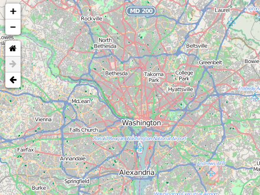

Leaflet.NavBar
==============

Simple navigation toolbar for Leaflet.

Demo: http://davidchouse.github.io/Leaflet.NavBar/



<a name="using" />
## Using the plugin

The default state for the control is just below the zoom control. This will allow map users to navigate forward and back in the map's view history as well as navigate to a home view.

````js
L.control.navbar().addTo(map);
````

Options for initialising the Leaflet.NavBar control.

| Option | Type | Default | Description
| --- | --- | --- | ---
| position | String | `'topleft'` | The initial position of the control.
| center | `L.LatLng` | Map's Current Position | The center point for the home view.
| zoom | Number | `0` | The zoom value for the home view.
